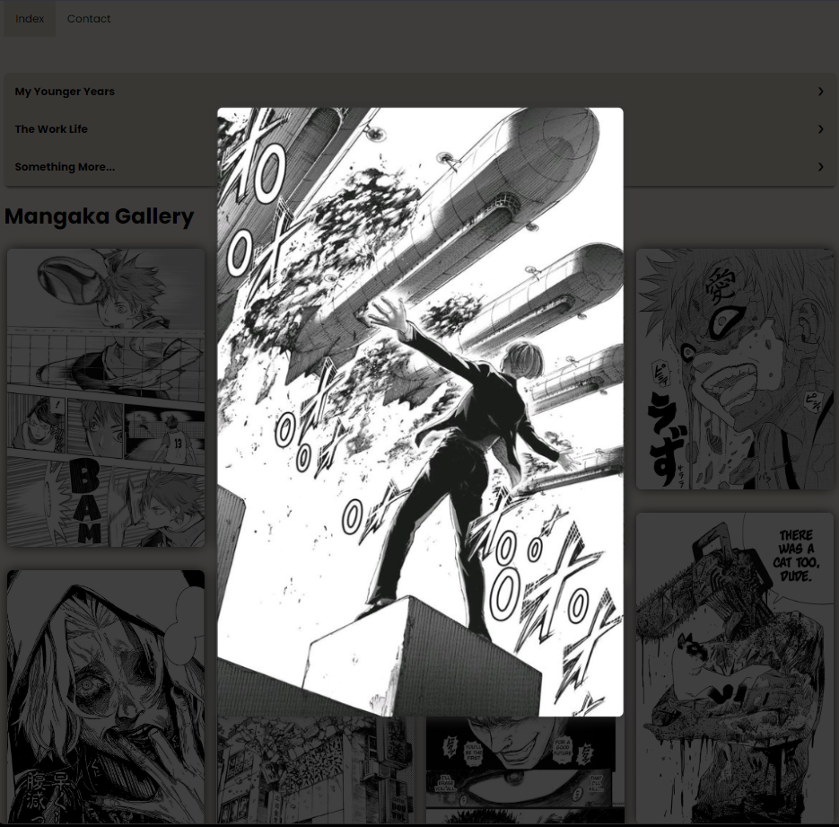

    

  <h3 align="center">Mangaka Website Project</h3>

## Table of Contents

  <ol>
  <li><a href="#about-the-project">About The Project</a></li>
    <li><a href="#Index">Index Page</a></li>
    <li><a href="#Contact">Contact Page</a></li>
    <li><a href="#License">License</a></li>
  </ol>
  
  ## About The Project

 

 A project of building a website/personal portofolio of a mangaka(manga artsit).
This is the project given:

    
    
   ## Index
 
 In the index page i wanted to have a responsive gallery and a accordion type about me. With ccs and some js in the gallery section. I was able to give it some mobility while it also looks pleasing to the eye.

    
    
    
     
 This is the end result:
    

    
    
    
    

##Contact

 On the contact page ,i added a contact form and also information on where they can reach the artist:

 
 
 Here is the end result:

 

<!-- LICENSE -->
## License

Distributed under the GPL License. See `LICENSE.txt` for more information.

(<a href="#readme-top">back to top</a>)

